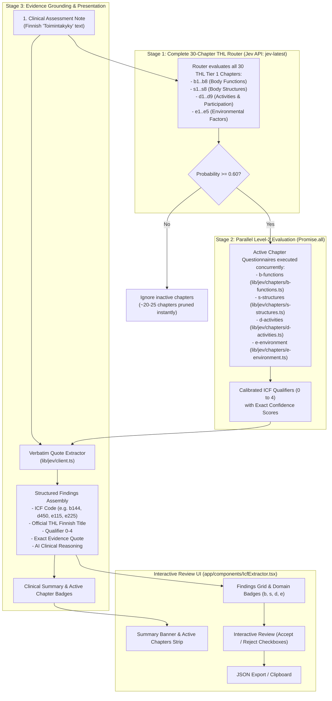

# ICF Code Extractor

AI-powered ICF (International Classification of Functioning, Disability and Health) code extraction application built with Next.js (App Router, Server Actions) and TypeScript.

The system analyzes medical and physiotherapy assessments written under the **Toimintakyky** (Functional Capacity) section, extracts matching official Finnish THL ICF codes and severity qualifiers (0–4), extracts verbatim supporting quotes from the text, and displays the findings in an interactive review interface.

---

## Architecture: Complete 30-Chapter Two-Stage Router

The app implements a **Two-Stage Hierarchical Router** covering all **30 Tier 1 Chapters** of the official THL ICF Classification (`1.2.246.537.6.48` in Koodistopalvelu Kanta):



---

## How It Works (Step-by-Step)

1. **Input Submission:**  
   The user enters or loads a Finnish functional capacity evaluation note into the UI (`app/components/IcfExtractor.tsx`) and submits the form.

2. **Stage 1 (30-Chapter Router):**  
   The Server Action (`app/actions/extract-icf.ts`) sends the note to TypeSafe System One (`jev-latest`) with a 30-question router schema covering all chapters (`b1`–`b8`, `s1`–`s8`, `d1`–`d9`, `e1`–`e5`). The model computes presence probabilities in ~1 second. Any chapter with $p \ge 0.60$ is activated.

3. **Stage 2 (Parallel Level-2 Evaluation):**  
   The system retrieves the targeted Level-2 question catalogs for the activated chapters and executes them concurrently using `Promise.all()`. Questions are evaluated against calibrated clinical criteria to determine exact ICF qualifiers (0 = no problem, 1 = mild, 2 = moderate, 3 = severe, 4 = complete; negative values for environmental barriers).

4. **Verbatim Evidence Grounding:**  
   For every confirmed ICF finding, the extractor searches the original clinical text for the exact sentence or clause providing supporting evidence, ensuring full transparency.

5. **Presentation & Export:**  
   The findings are displayed with domain badges (`b` = blue, `s` = amber, `d` = purple, `e` = orange), active chapter tags, and severity color coding. Clinicians can review, accept, or reject specific codes, and copy the final filtered JSON payload to the clipboard.

---

## Getting Started

### 1. Environment Configuration

Create a `.env.local` file with your TypeSafe API key:

```bash
TYPESAFE_API_KEY=your_typesafe_api_key_here
```

*(Optional: A direct OpenAI key starting with `sk-...` can also be supplied as `OPENAI_API_KEY` for fallback mode).*

### 2. Run the Development Server

```bash
bun dev
# or: npm run dev / pnpm dev
```

Open [http://localhost:3000](http://localhost:3000) in your browser.

---

## Project Structure

```
├── app/
│   ├── actions/
│   │   └── extract-icf.ts          # Server Action routing to Jev / OpenAI
│   ├── components/
│   │   └── IcfExtractor.tsx        # Client UI with evidence tags & checklist
│   ├── layout.tsx                  # Root layout & page metadata
│   └── page.tsx                    # Main entry page
├── lib/
│   ├── constants/
│   │   └── icf-rules.ts            # THL guidelines prompt & sample text
│   ├── jev/
│   │   ├── catalog.ts              # Core types & definitions
│   │   ├── router-schema.ts        # Complete 30-Chapter Tier 1 Router Schema
│   │   ├── chapters/               # Modular Level-2 Catalogs by Component
│   │   │   ├── b-functions.ts      # Chapters b1..b8
│   │   │   ├── s-structures.ts     # Chapters s1..s8
│   │   │   ├── d-activities.ts     # Chapters d1..d9
│   │   │   ├── e-environment.ts    # Chapters e1..e5
│   │   │   └── registry.ts         # Unified 30-chapter registry
│   │   └── client.ts               # Two-Stage Router client & evidence grounding
│   └── schemas/
│       └── icf.ts                  # Zod schemas for structured responses
└── .env.local                      # API keys configuration
```
