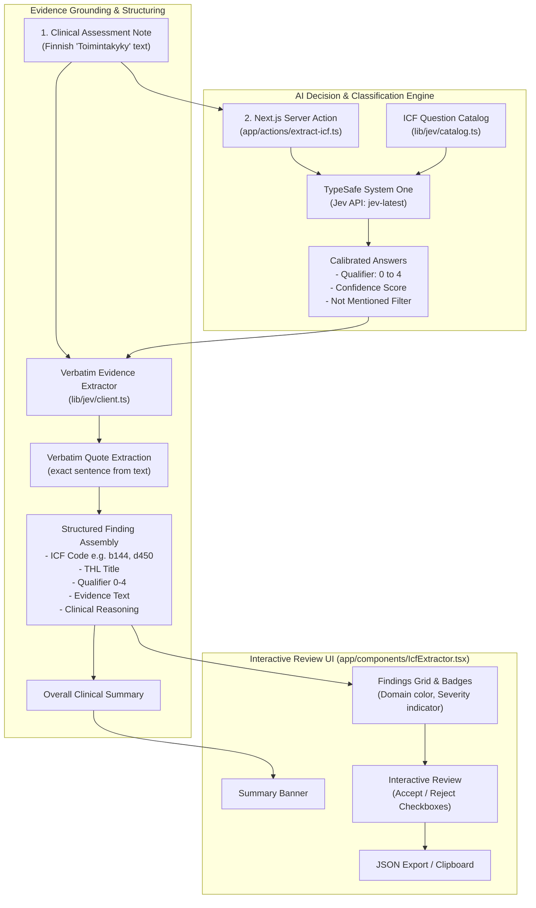

# ICF Code Extractor

AI-powered ICF (International Classification of Functioning, Disability and Health) code extraction application built with Next.js (App Router, Server Actions) and TypeScript.

The system analyzes medical and physiotherapy assessments written under the **Toimintakyky** (Functional Capacity) section, extracts matching official Finnish THL ICF codes and severity qualifiers (0–4), extracts verbatim supporting quotes from the text, and displays the findings in an interactive review interface.

---

## Workflow Diagram

The diagram below shows how a clinical note is transformed into structured ICF findings:



---

## How It Works (Step-by-Step)

1. **Input Submission:**  
   The user inputs or loads a Finnish functional capacity evaluation note into the UI (`app/components/IcfExtractor.tsx`) and submits the form.

2. **Server Action Dispatch:**  
   A Next.js Server Action (`app/actions/extract-icf.ts`) receives the text and invokes the TypeSafe Jev client (`lib/jev/client.ts`).

3. **Classification via TypeSafe System One (Jev):**  
   The clinical text is sent to the Jev model (`jev-latest`) alongside a catalog of targeted clinical questions (`lib/jev/catalog.ts`) covering key ICF areas:
   - **`b` – Body functions:** Memory (`b144`), muscle power (`b730`), balance/postural control (`b755`), pain (`b280`).
   - **`d` – Activities & Participation:** Changing position (`d410`), walking (`d450`), stairs (`d455`), personal hygiene (`d510`, `d520`, `d540`), domestic life (`d640`), community mobility (`d620`).
   - **`e` – Environmental factors:** Mobility aids (`e1151`), architectural supports/railings (`e150`).
   
   The model evaluates each domain against calibrated clinical criteria to determine whether an issue exists and assigns an ICF qualifier (0 = no problem, 1 = mild, 2 = moderate, 3 = severe, 4 = complete).

4. **Verbatim Evidence Grounding:**  
   For each confirmed ICF finding, the extractor searches the original assessment text for the exact sentence or clause providing evidence for the finding, ensuring every code is anchored to the text without hallucinations.

5. **Presentation & Export:**  
   The findings are displayed with domain-specific badges (`b` = blue, `d` = purple, `e` = orange) and severity color coding (green 0–1, yellow 2, red 3–4). Clinicians can review, accept, or reject specific codes, and copy the final structured JSON payload to the clipboard.

---

## Getting Started

### 1. Environment Configuration

Create a `.env.local` file with your TypeSafe API key:

```bash
TYPESAFE_API_KEY=your_typesafe_api_key_here
```

*(Optional: A direct OpenAI key starting with `sk-...` can also be supplied as `OPENAI_API_KEY` for fallback mode).*

### 2. Run the Development Server

```bash
bun dev
# or: npm run dev / pnpm dev
```

Open [http://localhost:3000](http://localhost:3000) in your browser.

---

## Project Structure

```
├── app/
│   ├── actions/
│   │   └── extract-icf.ts       # Server Action routing to Jev / OpenAI
│   ├── components/
│   │   └── IcfExtractor.tsx     # Client UI with evidence tags & checklist
│   ├── layout.tsx               # Root layout & page metadata
│   └── page.tsx                 # Main entry page
├── lib/
│   ├── constants/
│   │   ├── icf-rules.ts         # THL guidelines prompt & sample text
│   │   └── jev-icf-catalog.ts   # ICF domain definitions for Jev
│   ├── jev/
│   │   ├── catalog.ts           # Question schema & criteria for Jev
│   │   └── client.ts            # TypeSafe Jev API caller & evidence extractor
│   └── schemas/
│       └── icf.ts               # Zod schemas for structured responses
└── .env.local                   # API keys configuration
```
